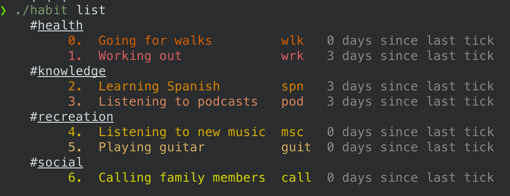

# habit 

`habit` is a CLI tool for tracking and visualizing your habits

What sets it apart from other task managers is its focus on habitual, repetitive tasks, as opposed to tasks that go away after completion, offering a means to maintain, track, and visualize your progress on tasks that serve more long term, personal goals.

`habit` understands that some items need a little work every day, and typically (unless there's something looming over your head it's hard to find the motivation to keep that daily work up!

## Screenshots

## Quick Start

Proper packaging coming soon. For now run `go build` followed by `./habit help`
## Features

### Create Habits

Habit are input via CLI and tagged with a category.

It will make the most semantic sense for you to use a [gerund phrase](https://en.wikipedia.org/wiki/Gerund) 
Example: `habit start 'Reaching out to friends' --tag social --shortName chatting`

A `tag` will group the habit with other habits in the same tag when displayed.
A `shortName` is an optional shorter way to refer to the habit when updating it. If not supplied, the first word will be used.

### Track Habit Progress 

Use a "tick" to track progress you've made toward a longterm goal / set of habits.
Example: `habit tick chatting`

### Visualize 

Beautiful colorized visualizations of your progress are at the heart of this project! What better way to be proud of the progress you've made?

There are two ways to visualize, `list` and `hist`

#### `list`
Output all your habits, grouped and colorized by the `tag` you have assigned them, along with the time since you last `tick`ed one.

Example: `habit list`

#### `hist`
Output a "histogram" of sorts to show your dilligence towards all your habits. This is very naive currently. Proper aggregation is soon to come.

Example: `habit hist`

